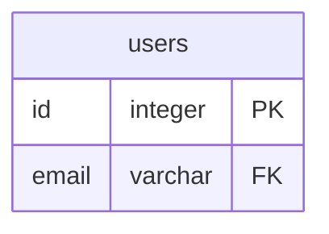
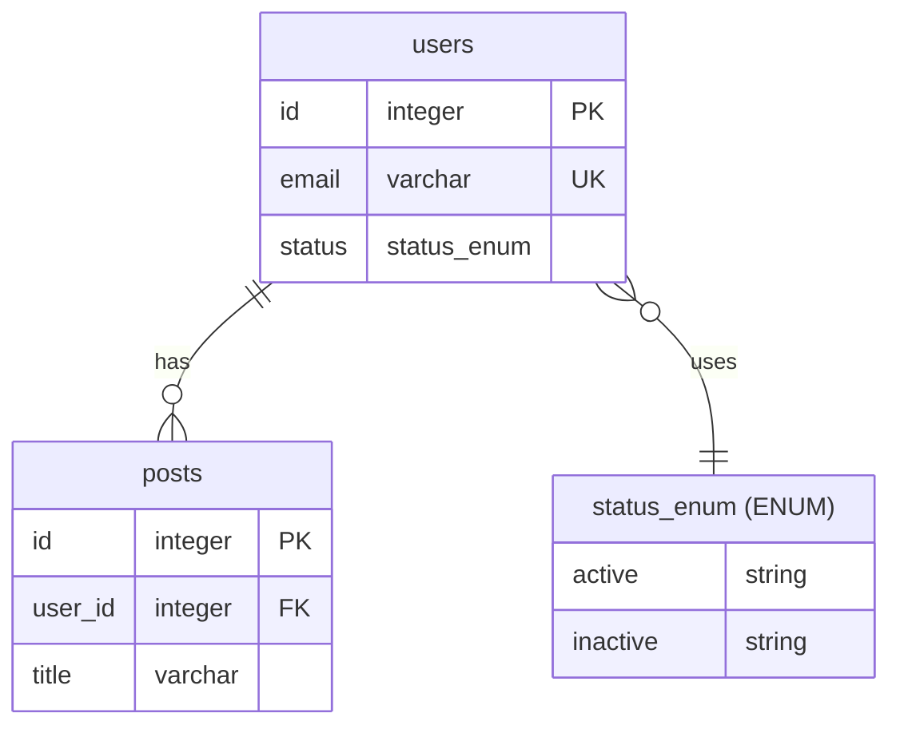

# Database ER Diagram Generator

A GitHub Action that generates Entity-Relationship (ER) diagrams in Mermaid format from PostgreSQL and MySQL databases. Built with TypeScript and Bun for fast execution.

## Features

- 🎨 Generates Mermaid ER diagrams from database schemas
- 🗄️ Supports **PostgreSQL** and **MySQL** databases
- 🔄 Supports ENUM types as pseudo-entities
- 🔑 Identifies Primary Keys (PK), Foreign Keys (FK), and Unique Keys (UK)
- 📊 Shows relationship cardinality (CASCADE vs non-CASCADE)
- 📝 Optional README integration with diagram embedding
- ⚡ Fast execution with Bun runtime

## Usage

### As a GitHub Action

**PostgreSQL Example:**
```yaml
name: Generate ER Diagram

on:
  push:
    branches: [main]

jobs:
  generate-diagram:
    runs-on: ubuntu-latest
    steps:
      - uses: actions/checkout@v4

      - name: Generate ER Diagram
        uses: ViniciusDev26/er-diagram@main
        with:
          db-type: postgresql
          db-host: localhost
          db-port: 5432
          db-name: mydb
          db-user: postgres
          db-pass: ${{ secrets.DB_PASSWORD }}
          write-to-readme: true
          readme-path: docs/README.md
```

**MySQL Example:**
```yaml
name: Generate ER Diagram

on:
  push:
    branches: [main]

jobs:
  generate-diagram:
    runs-on: ubuntu-latest
    steps:
      - uses: actions/checkout@v4

      - name: Generate ER Diagram
        uses: ViniciusDev26/er-diagram@main
        with:
          db-type: mysql
          db-host: localhost
          db-port: 3306
          db-name: mydb
          db-user: root
          db-pass: ${{ secrets.DB_PASSWORD }}
          write-to-readme: true
          readme-path: docs/README.md
```

### Local Development

```bash
# Install dependencies
bun install

# PostgreSQL
DB_TYPE=postgresql \
DB_HOST=localhost \
DB_PORT=5432 \
DB_NAME=mydb \
DB_USER=postgres \
DB_PASS=secret \
bun run generate

# MySQL
DB_TYPE=mysql \
DB_HOST=localhost \
DB_PORT=3306 \
DB_NAME=mydb \
DB_USER=root \
DB_PASS=secret \
bun run generate

# With README integration
DB_TYPE=postgresql \
DB_HOST=localhost \
DB_PORT=5432 \
DB_NAME=mydb \
DB_USER=postgres \
DB_PASS=secret \
WRITE_TO_README=true \
README_PATH=docs/README.md \
bun run generate-pg-diagram.ts
```

## Inputs

| Input | Description | Required | Default |
|-------|-------------|----------|---------|
| `db-type` | Type of database (`postgresql` or `mysql`) | No | `postgresql` |
| `db-host` | Host of the database | No | `localhost` |
| `db-port` | Port of the database | No | `5432` |
| `db-name` | Name of the database | Yes | - |
| `db-user` | User of the database | Yes | - |
| `db-pass` | Password of the database | Yes | - |
| `output-dir` | Directory where the diagram will be saved | No | `docs` |
| `write-to-readme` | Whether to write the diagram to the README file | No | `false` |
| `readme-path` | Path to the README file | No | `README.md` |
| `excluded-tables` | Comma-separated list of table names to exclude from the diagram | No | `flyway_schema_history` |

## Output

The action generates:

- **`docs/database-er-diagram.mmd`** - Standalone Mermaid diagram file
- **README file (optional)** - If `write-to-readme: true`, embeds the diagram between `<!-- ER_DIAGRAM_START -->` and `<!-- ER_DIAGRAM_END -->` markers

## README Integration

When `write-to-readme` is enabled, the action will:

1. **If markers exist**: Replace content between `<!-- ER_DIAGRAM_START -->` and `<!-- ER_DIAGRAM_END -->`
2. **If no markers**: Append diagram to the end of the README
3. **If README doesn't exist**: Create a new README with the diagram

### Markers Example

```markdown
# My Database

## Schema

<!-- ER_DIAGRAM_START -->

<!-- ER_DIAGRAM_END -->
```

## Diagram Features

### Entity Types

- **Tables**: Rendered with all columns and their types
- **ENUMs**: Shown as pseudo-entities with possible values

### Key Indicators

- `PK` - Primary Key
- `FK` - Foreign Key
- `UK` - Unique Key

### Relationship Types

- `||--o{` - Strong/identifying relationship (CASCADE delete)
- `||..o{` - Weak/non-identifying relationship (non-CASCADE delete)
- `}o--||` - Table uses ENUM type

### Excluded Tables

By default, `flyway_schema_history` is excluded from the diagram. You can customize this via the `excluded-tables` input:

```yaml
- name: Generate ER Diagram
  uses: ViniciusDev26/er-diagram@main
  with:
    # ... other inputs
    excluded-tables: "flyway_schema_history,temp_table,audit_log"
```

Or via environment variable:

```bash
EXCLUDED_TABLES="flyway_schema_history,temp_table" bun run generate
```

## Development

### Requirements

- Bun >= 1.0
- PostgreSQL or MySQL database access

### Running Test Databases with Docker

The project includes a `docker-compose.yml` file to easily spin up PostgreSQL and MySQL databases for testing:

```bash
# Start both databases
docker compose up -d

# Start only PostgreSQL
docker compose up -d postgres

# Start only MySQL
docker compose up -d mysql

# Stop all databases
docker compose down

# Stop and remove volumes (clean slate)
docker compose down -v
```

**Connection Details:**

PostgreSQL:
- Host: `localhost`
- Port: `5432`
- Database: `er-diagram`
- User: `postgres`
- Password: `postgres`

MySQL:
- Host: `localhost`
- Port: `3306`
- Database: `er-diagram`
- User: `mysql` (or `root`)
- Password: `mysql` (or `root` for root user)

### Project Structure

```
.
├── generate-pg-diagram.ts   # Main TypeScript script
├── action.yml               # GitHub Action definition
├── package.json             # Dependencies
├── CLAUDE.md               # AI assistant guidance
└── README.md               # This file
```

### How It Works

1. Connects to PostgreSQL using the `postgres` library
2. Queries database metadata from `information_schema` and `pg_catalog`
3. Extracts ENUMs, tables, columns, and relationships
4. Generates Mermaid diagram syntax
5. Writes to `.mmd` file and optionally updates README

## Example Output



## License

MIT

## Author

ViniciusDev26
